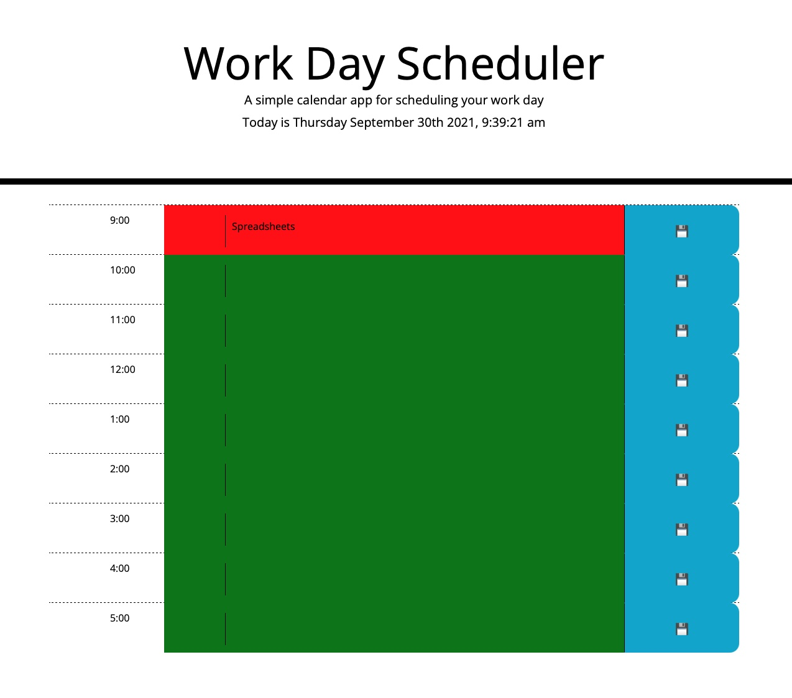

# Daily_Planner_TT
## Your Task

Like Marty McFly, our trusty programmer was tasked with traveling to the futurrr... later today?... LOOK FORWARD IN TIME!!!  The task of building a planner was upon us.  What would we use?  Would it be as simple as going to a website called getbootstrap and copying some lines of code.  Well, for our weary traveler, that was the start of the adventure. 

Once the easy task of setting up rows and columns had been achieved, the adventurer was tasked with making sure that the hours would change and the color of the boxes would show what time was at hand.  This was accomplished by traversing the path of the innerwebs and braving the dark paths to a deprecated old wizard of time named moment.js.  While this old wizard was in his waning hours, he still had enough power to harness the sands of time.     

With a mightly effort, a clock appeared!  It would change with every secound and would impact those around it.

The tired traveler then set out to ask what any user would like to do at any given time.  He felt as if he was being asked to be a genie and grant the wishes of people in the future, but the task was the task, and the job must get done.  The buttons were set and tributes were made.  The events would be retained in the planner as if carved in stone.  "Pushing other's buttons" seemed to be a specialty of the intrepid traveler.  In his wake was left a mess of code, but things seemed to work.
As the time slowly slipped by, the task seemed complete, but he knew the rest would not last long, and his name would be called upon again to complete another adventure!

You'll need to use the [Moment.js](https://momentjs.com/) library to work with date and time. Be sure to read the documentation carefully and concentrate on using Moment.js in the browser.

Thanks to Tutor Brian Lee for helping with the buttons!

## Objective
import event into a calendar 
## Needs to 
Open with current date
time blocks with 9-5 represented
as time passes, blocks go from green-future, to red-present, to gray-past
Click in block to add event save with button
saved information is locally stored and displays even on page refresh
Jumbotron
3 column
time| 70% middle to add info | save button (blue)
9 rows
3 columns 2-8-2
### Beautiful images

### The Pages of Destiny
the webpage (https://dertodd.github.io/Daily_Planner_TT/) and the gitHub (https://github.com/DerTodd/Daily_Planner_TT)
